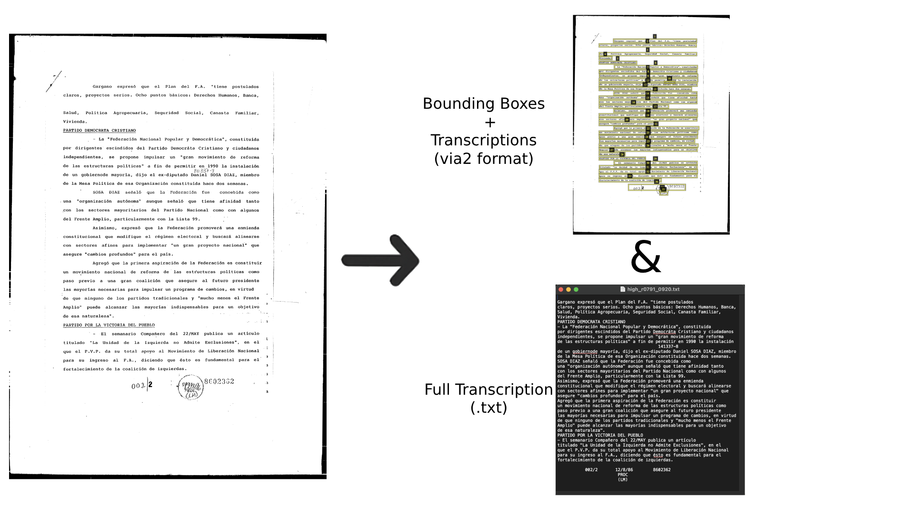
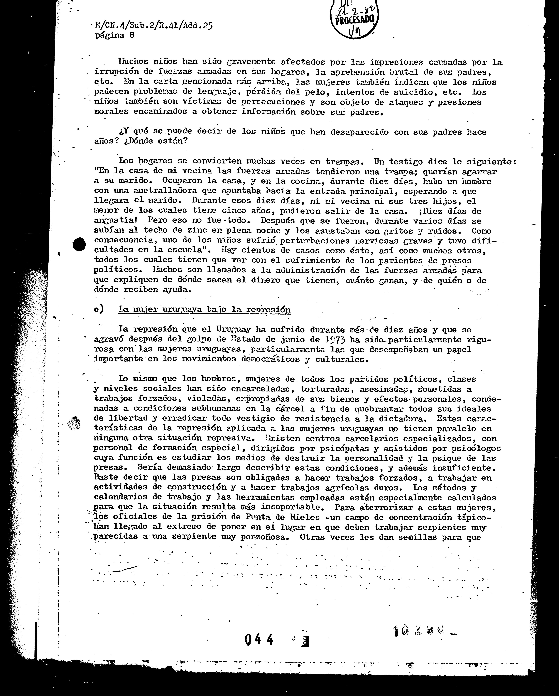
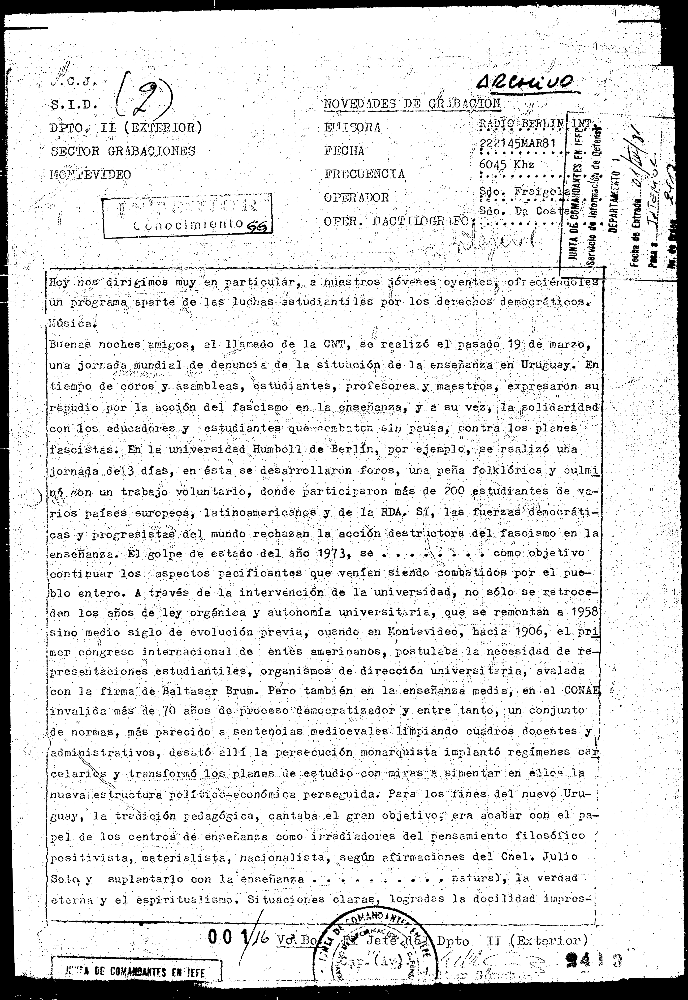
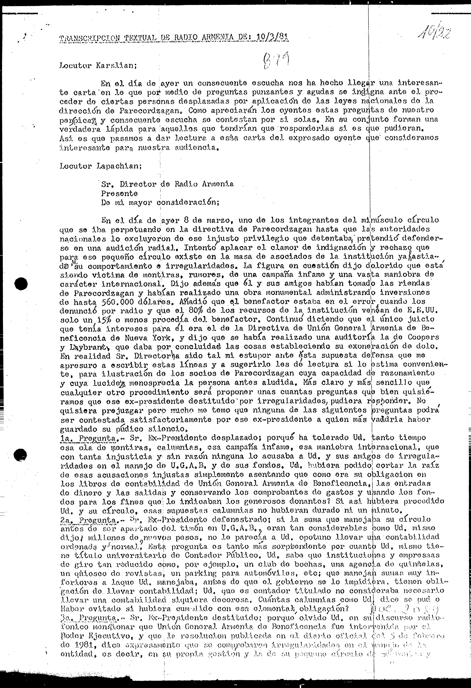

# OCR Berrutti Dataset



## 📥 Download
Download the complete dataset from:  
> [Download Dataset](https://iie.fing.edu.uy/proyectos/berrutti-ocr/berruti-dataset/)


## 📝 Brief Description
This repository contains digitized documents from Uruguay’s military dictatorship period. The dataset comprises:  
- **175** full-page images.  
- **175** complete text transcriptions in `.txt` format.  
- **8969** VIA2-format bounding boxes—one for each line of text in each document.  
---

## 💡 Examples of Use

For a quick example of how to use this dataset, see the [eda.ipynb](eda.ipynb) notebook, which provides a brief demonstration of loading and exploring the data.

---

## 📚 Context and Origin of the Documents

This dataset originates from the **Berrutti Archive**, a vast microfilm collection containing nearly 3 million pages produced during Uruguay’s military dictatorship (1968–1985). Most records are typewritten—often accompanied by handwritten notes—and primarily consist of intelligence reports, though other document types are also represented. All images were digitized in binary (black-and-white) format, which introduces noise, artifacts, and overlaps, making automated text recognition particularly challenging.

The documents in the collection are representative of the documents in the Berrutti collection. The Institucion Nacional de Derechos Humanos y Defensoría del Pueblo (INDDHH) of Uruguay, revised each document in conformity with Uruguayan Law and give the authorization for their use as part of this "OCR Berrutti Dataset". For further details, see the [authorization](docs/authorization_INDHH.pdf).

---

## 📂 Repository Structure

```plaintext
images/                        # Original images
  ├── high_<id>.png            # High quality
  ├── medium_<id>.png          # Medium quality
  └── low_<id>.png             # Low quality

bounding_boxes_lines_via2.json  # VIA2-format JSON annotations

full_text_transcriptions/       # Full transcriptions
  ├── <document_name>.txt       # Complete text (OCR + human refinement)
  └── ...                       # Additional files
```

---

## 🔖 Quality Levels

Image quality is subjective and context‑dependent. In this dataset, we define three distinct quality levels:
- **High**: Scans with minimal noise and clearly legible text.
- **Medium**: Scans with moderate noise or artifacts that may slightly affect readability.
- **Low**: Scans with significant noise, artifacts, or distortions that challenge automated text recognition.

For a detailed description of the criteria used to define these levels, see the article “[A computational framework for the analysis of the Uruguayan dictatorship archives.](https://www.colibri.udelar.edu.uy/jspui/handle/20.500.12008/26651)”  

---

## 🎨 Visual Examples

<p align="center">
  
  
  
</p>

---

## 📝 Full Text Transcription

The files in the `full_text_transcriptions/` directory were created manually by three independent reviewers into plain-text files.  

---

## 📝 Line-Level Bounding Boxes

Transcriptions in `bounding_boxes_lines/` were generated in three additional steps:  
1. **Automatic OCR** using Tesseract v4.1.  
2. Manual correction of the per-line bounding boxes produced by Tesseract, and manual correction of the corresponding lines of text.
3. **Review and refinement**: ach document was then checked and corrected by at least two human annotators using VIA2.


**Disclaimer:** Although every effort was made to ensure consistency, small variations between transcriptions may remain.

---

## ⚙️ Annotation Formats

Annotations are provided only in **VIA2** format, editable with [VIA](https://www.robots.ox.ac.uk/~vgg/software/via/).

---

## 🤝 Collaboration and Credits

This dataset is the result of collaboration between:  
- [**Instituto de Ingenieria Electrica de la Facultad de Ingenieria de la Universidad de la Republica**](iie.fing.edu.uy)  
- [**Centre Borelli ENS Paris-Saclay**](https://centreborelli.ens-paris-saclay.fr/en)  

The dataset authors are listed in alphabetical order by surname:  
- Diego Belzarena (Centre Borelli ENS Paris-Saclay / UdelaR)  
- Laura Carlevaro  
- [Alicia Fernández](https://iie.fing.edu.uy/~alicia/) (UdelaR)  
- Marina Gardella (Centre Borelli ENS Paris-Saclay)  
- [Camilo Mariño](https://scholar.google.com/citations?user=EXk6IrIAAAAJ&hl=en) (Centre Borelli ENS Paris-Saclay / UdelaR)  
- Seginus Mowlavi (Centre Borelli ENS Paris-Saclay)  
- Ignacio Ramirez (UdelaR)
- [Gregory Randall](https://scholar.google.com.uy/citations?user=GbQ02t0AAAAJ&hl=es) (UdelaR)  

---

## 📜 License and Copyright

The full license text is available in both English and Spanish:  
- [English version](docs/license_en.pdf)  
- [Versión en español](docs/license_es.pdf)

---

## 🕒 Version History

- **v1.0** (06/05/2025): First release of the dataset.
